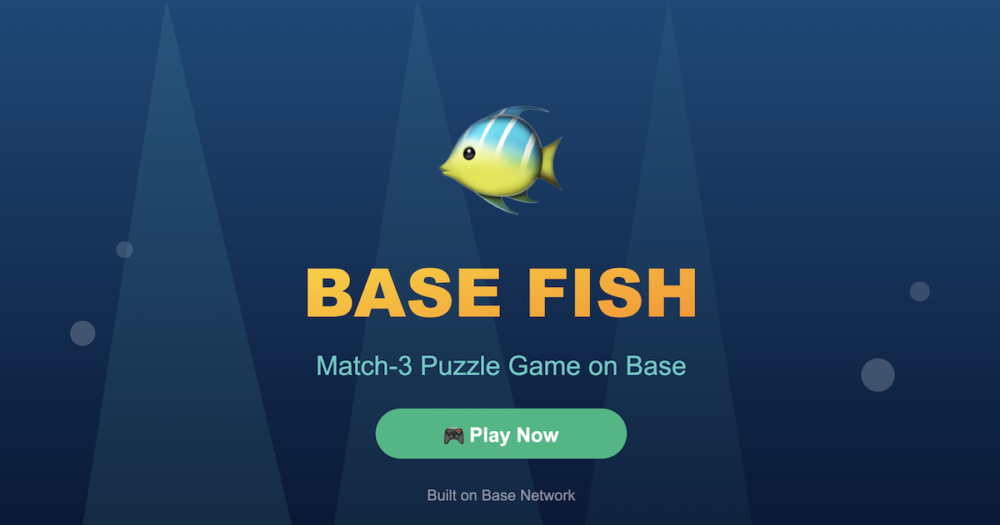

# 🐠 Fishdom - Base Mini App

A match-3 puzzle game built for Base Network and Farcaster Frames v2. Collect unique fish NFTs, complete levels, and compete on the global leaderboard!



## ✨ Features

- **Match-3 Gameplay**: Classic puzzle mechanics with water physics
- **10 Levels**: Increasing difficulty with target scores
- **NFT Characters**: Collect unique fish using ERC-1155 tokens
- **Global Leaderboard**: Compete with players worldwide
- **Farcaster Integration**: Seamless login and sharing
- **Base Network**: Low gas fees for NFT transactions

## 🎮 Game Characters

| Character | Rarity | Price |
|-----------|--------|-------|
| 🐠 Orange Fish | Default | Free |
| 🐟 Green Fish | Common | $1 (~0.0004 ETH) |
| 🐋 Blue Fish | Uncommon | $2 (~0.0008 ETH) |
| 🦑 Purple Fish | Rare | $3 (~0.0012 ETH) |
| 🦈 Gold Shark | Legendary | $5 (~0.002 ETH) |

## 🚀 Quick Start

### Prerequisites

- Node.js 18+
- npm or yarn
- A wallet with Base ETH (for deployment)

### Installation

```bash
# Clone the repository
git clone https://github.com/your-username/fishdom-base.git
cd fishdom-base

# Install dependencies
npm install

# Copy environment variables
cp .env.example .env
# Edit .env with your configuration

# Start development server
npm run dev
```

### Environment Variables

Create a `.env` file with the following variables:

```env
# Blockchain
PRIVATE_KEY=your_private_key
BASE_RPC_URL=https://mainnet.base.org
BASESCAN_API_KEY=your_basescan_api_key

# Firebase
VITE_FIREBASE_API_KEY=your_api_key
VITE_FIREBASE_AUTH_DOMAIN=your-project.firebaseapp.com
VITE_FIREBASE_PROJECT_ID=your-project-id
VITE_FIREBASE_STORAGE_BUCKET=your-project.appspot.com
VITE_FIREBASE_MESSAGING_SENDER_ID=123456789
VITE_FIREBASE_APP_ID=1:123456789:web:abc123

# WalletConnect
VITE_WALLETCONNECT_PROJECT_ID=your_project_id
```

## 📦 Deploying the Smart Contract

### 1. Deploy to Base Sepolia (Testnet)

```bash
# Deploy to testnet first
npx hardhat run scripts/deploy.js --network baseSepolia
```

### 2. Deploy to Base Mainnet

```bash
# Deploy to mainnet
npx hardhat run scripts/deploy.js --network base
```

### 3. Update Contract Address

After deployment, update `src/lib/contracts.ts`:

```typescript
export const CHARACTER_STORE_ADDRESS = '0xYOUR_CONTRACT_ADDRESS' as `0x${string}`;
```

## 🔥 Firebase Setup

### 1. Create a Firebase Project

1. Go to [Firebase Console](https://console.firebase.google.com)
2. Create a new project
3. Enable Firestore Database

### 2. Configure Firestore Rules

```javascript
rules_version = '2';
service cloud.firestore {
  match /databases/{database}/documents {
    // Users collection
    match /users/{userId} {
      allow read: if true;
      allow write: if request.auth != null;
    }
    
    // Scores collection
    match /scores/{scoreId} {
      allow read: if true;
      allow create: if true;
    }
  }
}
```

### 3. Create Indexes

Create composite indexes for the leaderboard queries:
- Collection: `users`
- Fields: `lastPlayed` (Descending), `highScore` (Descending)

## 🖼️ Farcaster Frame Setup

### 1. Update manifest.json

Edit `public/manifest.json` with your domain and Farcaster account details:

```json
{
  "frame": {
    "homeUrl": "https://your-domain.com",
    "imageUrl": "https://your-domain.com/frame-image.png",
    "webhookUrl": "https://your-domain.com/api/webhook"
  }
}
```

### 2. Generate Account Association

Generate the account association signature using the Farcaster SDK:

```javascript
import { generateAccountAssociation } from '@farcaster/frame-sdk';

const association = await generateAccountAssociation({
  fid: YOUR_FID,
  domain: 'your-domain.com'
});
```

### 3. Validate in Warpcast

Test your frame at: https://warpcast.com/~/developers/frames

## 📁 Project Structure

```
fishdom-base/
├── contracts/
│   └── CharacterStore.sol    # ERC-1155 NFT contract
├── scripts/
│   └── deploy.js             # Deployment script
├── src/
│   ├── components/
│   │   ├── Leaderboard.tsx   # Leaderboard UI
│   │   └── CharacterShop.tsx # NFT shop UI
│   ├── game/
│   │   └── GameEngine.js     # Phaser.js game logic
│   ├── lib/
│   │   ├── contracts.ts      # Contract ABIs
│   │   ├── firebase.ts       # Firebase config
│   │   └── wagmi.ts          # Wagmi config
│   ├── App.tsx               # Main app component
│   ├── main.tsx              # Entry point
│   └── index.css             # Global styles
├── public/
│   └── manifest.json         # Farcaster manifest
├── hardhat.config.js         # Hardhat config
├── vite.config.ts            # Vite config
├── tailwind.config.js        # Tailwind config
└── package.json
```

## 🛠️ Tech Stack

- **Frontend**: React 18, TypeScript, TailwindCSS, Framer Motion
- **Game Engine**: Phaser.js 3.85
- **Web3**: Wagmi, Viem, @farcaster/frame-sdk
- **Backend**: Firebase Firestore
- **Smart Contract**: Solidity, OpenZeppelin, Hardhat
- **Blockchain**: Base Network (L2)

## 🎯 Game Mechanics

### Scoring System

- Basic match (3 tiles): 30 points
- Extended match (4+ tiles): Bonus multiplier
- Combo chains: Up to 5x multiplier

### Level Progression

| Level | Moves | Target Score |
|-------|-------|--------------|
| 1 | 30 | 500 |
| 2 | 28 | 800 |
| 3 | 26 | 1,200 |
| 4 | 24 | 1,600 |
| 5 | 22 | 2,000 |
| 6 | 20 | 2,500 |
| 7 | 18 | 3,000 |
| 8 | 16 | 3,500 |
| 9 | 14 | 4,000 |
| 10 | 12 | 5,000 |

## 🚢 Deployment

### Build for Production

```bash
npm run build
```

### Deploy to Vercel

```bash
vercel deploy --prod
```

### Deploy to Base Mini Apps

1. Build the production bundle
2. Upload to your hosting provider
3. Submit to Base Mini Apps directory

## 📄 License

MIT License - feel free to use this as a template for your own Base Mini Apps!

## 🤝 Contributing

Contributions are welcome! Please feel free to submit a Pull Request.

## 🔗 Links

- [Base Network](https://base.org)
- [Farcaster](https://farcaster.xyz)
- [Warpcast](https://warpcast.com)
- [Base GitHub](https://github.com/base)

---

Built with 💙 on Base
